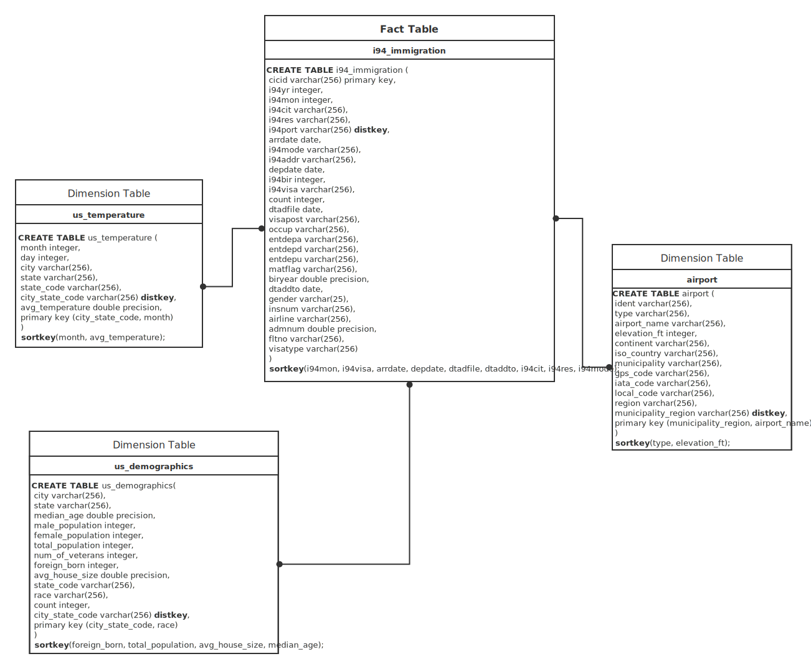
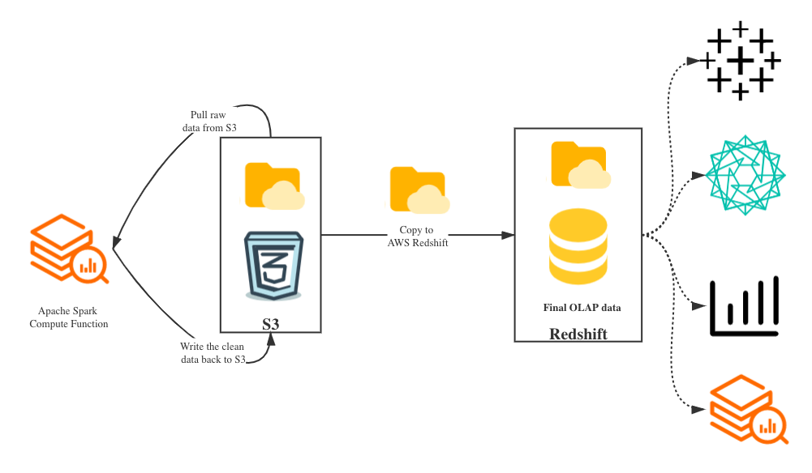

# The Design of I94 Immigration Activities ETL Pipelines

### The Capstone Project for [Data Engineering Nanodegree @Udacity](https://www.udacity.com/course/data-engineer-nanodegree--nd027)
#### Project Summary

In this project, I will leverage the data, which will be described in the **Describe and Gather Data** section, to design ETL pipelines about the immigration activities across all the valid **airports (cities)** in 2016. The end-users - potential data analysts and data scientists should be able to use the data to find out/resolve the issues such as how to improve the efficiency for the general I94 Immigration activities, e.g. better organize the correct workforce to support inbound/outbound customs.

The project follows the follow steps:
* Step 1: Scope the Project and Gather Data
* Step 2: Explore and Assess the Data
* Step 3: Define the Data Model
* Step 4: Run ETL to Model the Data
* Step 5: Complete Project Write Up


### Step 1: Scope the Project and Gather Data
#### Scope 

At the beginning of the design, as the designer and data engineer for this project, I'd like to be empathic for the potential end-users. Then, there are some assumptions on my side:

> If I am the analyst that need to think about issues such as improving the efficiency during the immigration activities, I would like to figure out that whether travel activity patterns are related to some sepcific weather situations, demographics of different areas and locations of the airports.

Thus, I will try to use all of 4 data sets described in the below section.

This project will use AWS Redshift as the data warehouse to support the OLAP functionality and Apache Spark (PySpark) as the data processing framework and compute function to do data cleaning and transformations, and all the raw data ana intermediate data will resides on AWS S3 - the raw data are provdied by Udacity and reside on the virtual machine, but they will be shipped to AWS S3, and after the data cleaning, the cleaner version will be placed on AWS S3 - there will be a loader to load those clean data into Redshift.


#### Describe and Gather Data 

This capstone project uses below 4 data sets, for the **I94 Immigration Data (2016)**, there is also a correspoding dictionary data set.

- **I94 Immigration Data (2016)**: This data comes from the US National Tourism and Trade Office. A data dictionary is included in the workspace. Read more about it [here](https://travel.trade.gov/research/reports/i94/historical/2016.html).

    - **I94 Dictionary data set**: contains all [key,value] mappings for some important columns, **they could be used to do value mappings** and **also could be used to filter out invalid data**, 
                            e.g.[403,"INVALID: AMERICAN SAMOA"] and [589,"No Country Code (589)"] in the i94cit_dictionary.csv - records with these mapping keys could be removed.
        - **i94addr dictionary**: contains all [key,value] mappings for i94addr column
        - **i94cit dictionary**: contains all [key,value] mappings for i94cit column
        - **i94mode dictionary**: contains all [key,value] mappings for i94mode column
        - **i94port dictionary**: contains all [key,value] mappings for i94port column
        - **i94res dictionary**: contains all [key,value] mappings for i94res column
        - **i94visa dictionary**: contains all [key,value] mappings for i94visa column


- **World Temperature Data**: This dataset records the information about the global temperature change, and it came from Kaggle. Read more about it [here](https://www.kaggle.com/berkeleyearth/climate-change-earth-surface-temperature-data).


- **U.S. City Demographic Data**: This data comes from OpenSoft. Read more about it [here](https://public.opendatasoft.com/explore/dataset/us-cities-demographics/export/). It seems contains a potential interesting colum - `Foreign-born` - might be related to analyzing the immigration activities.


- **Airport Code Table**: This is a simple table of airport codes and corresponding cities. Read more about it [here](https://datahub.io/core/airport-codes#data).


### Step 2: Explore and Assess the Data
#### Explore the Data 

- **I94 Immigration Data (2016)**

As described in Step 1, some of values in specific columns - `i94yr`, `i94mon`, `i94bir`, `i94addr`, `i94cit`, `i94mode`, `i94port`, `i94res` and `i94visa` - The invalid values for some columns will still be kept, but those invalid/null cells will be replaced by strings such as `NOT_IN_i94visa_DICTIONARY`, `NOT_IN_i94bir_DICTIONARY`, `NOT_IN_i94cit_DICTIONARY`, and so on. The reason why I do not want to simply remove them is becasue they literally happened, and they should be kept, even there might be missing values, peple might still be able to trace back to the complete information by using other vlaues in other columns.

- **World Temperature Data**

This data set contains temperature of worldwide cities from 1743-11-01 to 2013-09-01 - for each month, the data points only got recorded in the 1st day. I think for the whole data set, I may only want to keep the `United States` records for this project.

The I94 Immigration Data is in 2016, so it looks like this temperature data could not ideally cover our I94 immigration data.

However, I dont want to give up this data set at all, and I'd like to use the records start from 2003-01-01 (2003-01-01 ~ 2013-09-01), and assume the situation of weather in U.S. has not changed a lot (I wish), then for every city and every day (month-day, e.g. 01-02), I can calculate the avg_temperature.

Meanwhile, by using [reverse_geocoder](https://github.com/thampiman/reverse-geocoder) and `i94addr_dictionary.csv`, I could get `state` and `state_code` for each temperature record, these fields could be used to join with the I94 Immigration Data to potentially investigate the relationship between immigration activities and temperature (some seasonal affects maybe).

- **U.S. City Demographic Data**

This existing data set looks ok, not too many ETL processes on this one.

- **Airport Code Table**

Only keep the US airport records. The `iso_region` column in the Airport Code data should be cleaned - split it and get the `region` value, then concatenate it with `municipality`. 

#### Cleaning Steps

- **I94 Immigration Data (2016)**

    - Original Data:

| cicid | i94yr  | i94mon | i94cit | i94res | i94port | arrdate | i94mode | i94addr | depdate | i94bir | i94visa | count | dtadfile | visapost | occup | entdepa | entdepd | entdepu | matflag | biryear | dtaddto  | gender | insnum | airline | admnum       | fltno | visatype |
|-------|--------|--------|--------|--------|---------|---------|---------|---------|---------|--------|---------|-------|----------|----------|-------|---------|---------|---------|---------|---------|----------|--------|--------|---------|--------------|-------|----------|
| 6.0   | 2016.0 | 4.0    | 692.0  | 692.0  | XXX     | 20573.0 | NaN     | None    | NaN     | 37.0   | 2.0     | 1.0   | None     | None     | None  | T       | None    | U       | None    | 1979.0  | 10282016 | None   | None   | None    | 1.897628e+09 | None  | B2       |
| 7.0   | 2016.0 | 4.0    | 254.0  | 276.0  | ATL     | 20551.0 | 1.0     | AL      | NaN     | 25.0   | 3.0     | 1.0   | 20130811 | SEO      | None  | G       | None    | Y       | None    | 1991.0  | D/S      | M      | None   | None    | 3.736796e+09 | 00296 | F1       |
| 15.0  | 2016.0 | 4.0    | 101.0  | 101.0  | WAS     | 20545.0 | 1.0     | MI      | 20691.0 | 55.0   | 2.0     | 1.0   | 20160401 | None     | None  | T       | O       | None    | M       | 1961.0  | 09302016 | M      | None   | OS      | 6.666432e+08 | 93    | B2       |
| 16.0  | 2016.0 | 4.0    | 101.0  | 101.0  | NYC     | 20545.0 | 1.0     | MA      | 20567.0 | 28.0   | 2.0     | 1.0   | 20160401 | None     | None  | O       | O       | None    | M       | 1988.0  | 09302016 | None   | None   | AA      | 9.246846e+10 | 00199 | B2       |
| 17.0  | 2016.0 | 4.0    | 101.0  | 101.0  | NYC     | 20545.0 | 1.0     | MA      | 20567.0 | 4.0    | 2.0     | 1.0   | 20160401 | None     | None  | O       | O       | None    | M       | 2012.0  | 09302016 | None   | None   | AA      | 9.246846e+10 | 00199 | B2       |
| 18.0  | 2016.0 | 4.0    | 101.0  | 101.0  | NYC     | 20545.0 | 1.0     | MI      | 20555.0 | 57.0   | 1.0     | 1.0   | 20160401 | None     | None  | O       | O       | None    | M       | 1959.0  | 09302016 | None   | None   | AZ      | 9.247104e+10 | 00602 | B1       |
| 19.0  | 2016.0 | 4.0    | 101.0  | 101.0  | NYC     | 20545.0 | 1.0     | NJ      | 20558.0 | 63.0   | 2.0     | 1.0   | 20160401 | None     | None  | O       | K       | None    | M       | 1953.0  | 09302016 | None   | None   | AZ      | 9.247140e+10 | 00602 | B2       |
| 20.0  | 2016.0 | 4.0    | 101.0  | 101.0  | NYC     | 20545.0 | 1.0     | NJ      | 20558.0 | 57.0   | 2.0     | 1.0   | 20160401 | None     | None  | O       | K       | None    | M       | 1959.0  | 09302016 | None   | None   | AZ      | 9.247161e+10 | 00602 | B2       |
| 21.0  | 2016.0 | 4.0    | 101.0  | 101.0  | NYC     | 20545.0 | 1.0     | NY      | 20553.0 | 46.0   | 2.0     | 1.0   | 20160401 | None     | None  | O       | O       | None    | M       | 1970.0  | 09302016 | None   | None   | AZ      | 9.247080e+10 | 00602 | B2       |
| 22.0  | 2016.0 | 4.0    | 101.0  | 101.0  | NYC     | 20545.0 | 1.0     | NY      | 20562.0 | 48.0   | 1.0     | 1.0   | 20160401 | None     | None  | O       | O       | None    | M       | 1968.0  | 09302016 | None   | None   | AZ      | 9.247849e+10 | 00608 | B1       |

- Mainly just map values for `i94yr`, `i94mon`, `i94bir`, `i94addr`, `i94cit`, `i94mode`, `i94port`, `i94res` and `i94visa` columns:

    _The invalid values will not be replaced by strings such as `NOT_IN_i94visa_DICTIONARY`, `NOT_IN_i94bir_DICTIONARY`, `NOT_IN_i94cit_DICTIONARY`, and so on_

- Traverse all 12-month data sets and apply the same logic above

    - Clean Data:

|cicid  |i94yr|i94cit        |i94res        |i94port          |arrdate|i94mode|i94addr |depdate|i94bir|i94visa |count|dtadfile|visapost|occup|entdepa|entdepd|entdepu|matflag|biryear|dtaddto |gender|insnum|airline|admnum         |fltno|visatype|i94mon|
|-------|-----|--------------|--------------|-----------------|-------|-------|--------|-------|------|--------|-----|--------|--------|-----|-------|-------|-------|-------|-------|--------|------|------|-------|---------------|-----|--------|------|
|3500517|2016 |UNITED KINGDOM|UNITED KINGDOM|NIAGARA FALLS, NY|2016-11-19|Land   |NEW YORK|1960-01-01|45    |Pleasure|1.0  |2016-11-19|null    |null |Z      |W      |null   |M      |1971.0 |2017-02-16|F     |00111 |null   |1.3768575485E10|LAND |WT      |11    |
|3472340|2016 |UNITED KINGDOM|UNITED KINGDOM|NIAGARA FALLS, NY|2016-11-19|Land   |NEW YORK|1960-01-01|30    |Pleasure|1.0  |2016-11-19|null    |null |Z      |W      |null   |M      |1986.0 |2017-02-16|M     |00111 |null   |1.3768771685E10|LAND |WT      |11    |
|3477995|2016 |UNITED KINGDOM|UNITED KINGDOM|NIAGARA FALLS, NY|2016-11-19|Land   |NEW YORK|1960-01-01|1     |Pleasure|1.0  |2016-11-19|null    |null |Z      |W      |null   |M      |2015.0 |2017-02-16|F     |00111 |null   |1.3768864185E10|LAND |WT      |11    |
|3516439|2016 |UNITED KINGDOM|UNITED KINGDOM|NIAGARA FALLS, NY|2016-11-19|Land   |NEW YORK|2016-12-23|5     |Pleasure|1.0  |2016-11-19|null    |null |Z      |K      |null   |M      |2011.0 |2017-02-16|M     |22864 |null   |1.3782401585E10|LAND |WT      |11    |
|3521735|2016 |UNITED KINGDOM|UNITED KINGDOM|NIAGARA FALLS, NY|2016-11-19|Land   |NEW YORK|2016-12-23|2     |Pleasure|1.0  |2016-11-19|null    |null |Z      |K      |null   |M      |2014.0 |2017-02-16|F     |22864 |null   |1.3782600485E10|LAND |WT      |11    |
|3524323|2016 |UNITED KINGDOM|UNITED KINGDOM|NIAGARA FALLS, NY|2016-11-19|Land   |NEW YORK|2016-12-29|35    |Pleasure|1.0  |2016-11-19|null    |null |Z      |K      |null   |M      |1981.0 |2017-02-16|M     |19796 |null   |1.3782693085E10|LAND |WT      |11    |
|3504360|2016 |UNITED KINGDOM|UNITED KINGDOM|NIAGARA FALLS, NY|2016-11-19|Land   |NEW YORK|2016-12-28|7     |Pleasure|1.0  |2016-11-19|null    |null |Z      |K      |null   |M      |2009.0 |2017-02-16|M     |19796 |null   |1.3782736085E10|LAND |WT      |11    |
|3511273|2016 |UNITED KINGDOM|UNITED KINGDOM|NIAGARA FALLS, NY|2016-11-19|Land   |NEW YORK|2016-12-28|9     |Pleasure|1.0  |2016-11-19|null    |null |Z      |K      |null   |M      |2007.0 |2017-02-16|F     |null  |null   |1.3783675785E10|LAND |WT      |11    |
|3517813|2016 |UNITED KINGDOM|UNITED KINGDOM|NIAGARA FALLS, NY|2016-11-19|Land   |NEW YORK|2016-12-23|32    |Pleasure|1.0  |2016-11-19|null    |null |Z      |K      |null   |M      |1984.0 |2017-02-16|F     |null  |null   |1.3783879185E10|LAND |WT      |11    |
|3722246|2016 |UNITED KINGDOM|UNITED KINGDOM|NIAGARA FALLS, NY|2016-11-20|Land   |NEW YORK|2016-11-23|43    |Pleasure|1.0  |2016-11-20|null    |null |Z      |O      |null   |M      |1973.0 |2017-02-18|F     |12199 |null   |1.3837985485E10|LAND |WT      |11    |

For detailed info, please review the `etl_i94_immigration()` in the [etl.py](etl.py)

- **World (US) Temperature Data**

    - Original Data:

| dt         | AverageTemperature | AverageTemperatureUncertainty | City  | Country | Latitude | Longitude |
|------------|--------------------|-------------------------------|-------|---------|----------|-----------|
| 1743-11-01 | 6.068              | 1.737                         | Århus | Denmark | 57.05N   | 10.33E    |
| 1743-12-01 | NaN                | NaN                           | Århus | Denmark | 57.05N   | 10.33E    |
| 1744-01-01 | NaN                | NaN                           | Århus | Denmark | 57.05N   | 10.33E    |
| 1744-02-01 | NaN                | NaN                           | Århus | Denmark | 57.05N   | 10.33E    |
| 1744-03-01 | NaN                | NaN                           | Århus | Denmark | 57.05N   | 10.33E    |

- Filter records only after **2003-01-01**
- Keep only **United States** records
- Calculate daily average temperature across all U.S. cities
- Leverge (`Latitude`,`Longitude`), [reverse_geocoder](https://github.com/thampiman/reverse-geocoder) and `i94addr_dictionary.csv` to find out the states and state codes in the US.
- Form the simulated 2016 date (\``month`\`\``day`\`2016)
- Output data into parquet files

    - Clean Data:

|month|day|city      |state     |state_code|city_state_code|avg_temperature   |
|-----|---|----------|----------|----------|---------------|------------------|
|3    |1  |Laredo    |Texas     |TX        |LAREDO, TX     |19.876454545454546|
|3    |1  |Paterson  |New Jersey|NJ        |PATERSON, NJ   |4.035363636363637 |
|3    |1  |Berkeley  |California|CA        |BERKELEY, CA   |12.75790909090909 |
|3    |1  |Lafayette |Louisiana |LA        |LAFAYETTE, LA  |17.333181818181817|
|3    |1  |Wichita   |Kansas    |KS        |WICHITA, KS    |9.110454545454546 |
|3    |1  |Fort Worth|Texas     |TX        |FORT WORTH, TX |14.68290909090909 |
|3    |1  |Arlington |Maryland  |MD        |ARLINGTON, MD  |6.898090909090908 |
|3    |1  |Savannah  |Georgia   |GA        |SAVANNAH, GA   |15.844454545454546|
|3    |1  |Houston   |Texas     |TX        |HOUSTON, TX    |17.665            |
|3    |1  |Lansing   |Michigan  |MI        |LANSING, MI    |2.749181818181818 |


For detailed info, please review the `etl_world_temperature()` in the [etl.py](etl.py)

- **U.S. City Demographic Data**

    - Original Data:

| City             | State         | Median Age | Male Population | Female Population | Total Population | Number of Veterans | Foreign-born | Average Household Size | State Code | Race                      | Count |
|------------------|---------------|------------|-----------------|-------------------|------------------|--------------------|--------------|------------------------|------------|---------------------------|-------|
| Silver Spring    | Maryland      | 33.8       | 40601           | 41862             | 82463            | 1562               | 30908        | 2.60                   | MD         | Hispanic or Latino        | 25924 |
| Quincy           | Massachusetts | 41.0       | 44129           | 49500             | 93629            | 4147               | 32935        | 2.39                   | MA         | White                     | 58723 |
| Hoover           | Alabama       | 38.5       | 38040           | 46799             | 84839            | 4819               | 8229         | 2.58                   | AL         | Asian                     | 4759  |
| Rancho Cucamonga | California    | 34.5       | 88127           | 87105             | 175232           | 5821               | 33878        | 3.18                   | CA         | Black or African-American | 24437 |
| Newark           | New Jersey    | 34.6       | 138040          | 143873            | 281913           | 5829               | 86253        | 2.73                   | NJ         | White                     | 76402 |

This data set has been already "clean", so there are no heavy ETL processes, btw, it seems 'New York' and 'LA' have are the top 2 cities with the highest number of `Foreign-born` cities.

- Rename headers to lower case
- Concatenate `city` with `state_code` to make a `city_state_code` field

    - Clean Data:

|city            |state         |median_age|male_population|female_population|total_population|num_of_veterans|foreign_born|avg_house_size|state_code|race                             |count|city_state_code     |
|----------------|--------------|----------|---------------|-----------------|----------------|---------------|------------|--------------|----------|---------------------------------|-----|--------------------|
|Silver Spring   |Maryland      |33.8      |40601          |41862            |82463           |1562           |30908       |2.6           |MD        |Hispanic or Latino               |25924|SILVER SPRING, MD   |
|Quincy          |Massachusetts |41.0      |44129          |49500            |93629           |4147           |32935       |2.39          |MA        |White                            |58723|QUINCY, MA          |
|Hoover          |Alabama       |38.5      |38040          |46799            |84839           |4819           |8229        |2.58          |AL        |Asian                            |4759 |HOOVER, AL          |
|Rancho Cucamonga|California    |34.5      |88127          |87105            |175232          |5821           |33878       |3.18          |CA        |Black or African-American        |24437|RANCHO CUCAMONGA, CA|
|Newark          |New Jersey    |34.6      |138040         |143873           |281913          |5829           |86253       |2.73          |NJ        |White                            |76402|NEWARK, NJ          |
|Peoria          |Illinois      |33.1      |56229          |62432            |118661          |6634           |7517        |2.4           |IL        |American Indian and Alaska Native|1343 |PEORIA, IL          |
|Avondale        |Arizona       |29.1      |38712          |41971            |80683           |4815           |8355        |3.18          |AZ        |Black or African-American        |11592|AVONDALE, AZ        |
|West Covina     |California    |39.8      |51629          |56860            |108489          |3800           |37038       |3.56          |CA        |Asian                            |32716|WEST COVINA, CA     |
|O'Fallon        |Missouri      |36.0      |41762          |43270            |85032           |5783           |3269        |2.77          |MO        |Hispanic or Latino               |2583 |O'FALLON, MO        |
|High Point      |North Carolina|35.5      |51751          |58077            |109828          |5204           |16315       |2.65          |NC        |Asian                            |11060|HIGH POINT, NC      |

For detailed info, please review the `etl_us_cities_demographics()` in the [etl.py](etl.py)

- **Airport Code (US) Table**

    - Original Data:

| ident | type          | airport_name                       | elevation_ft | continent | iso_country | iso_region | municipality | gps_code | iata_code | local_code | coordinates                             |
|-------|---------------|------------------------------------|--------------|-----------|-------------|------------|--------------|----------|-----------|------------|-----------------------------------------|
| 00A   | heliport      | Total Rf Heliport                  | 11           | NA        | US          | US-PA      | Bensalem     | 00A      | None      | 00A        | -74.93360137939453, 40.07080078125      |
| 00AA  | small_airport | Aero B Ranch Airport               | 3435         | NA        | US          | US-KS      | Leoti        | 00AA     | None      | 00AA       | -101.473911, 38.704022                  |
| 00AK  | small_airport | Lowell Field                       | 450          | NA        | US          | US-AK      | Anchor Point | 00AK     | None      | 00AK       | -151.695999146, 59.94919968             |
| 00AL  | small_airport | Epps Airpark                       | 820          | NA        | US          | US-AL      | Harvest      | 00AL     | None      | 00AL       | -86.77030181884766, 34.86479949951172   |
| 00AR  | closed        | Newport Hospital & Clinic Heliport | 237          | NA        | US          | US-AR      | Newport      | None     | None      | None       | -91.254898, 35.6087                     |

- Only keep `US` airport records
- Split `iso_region` to generate `municipality_region` column with `municipality`

    - Clean Data:

|ident|type          |airport_name           |elevation_ft|continent|iso_country|municipality   |gps_code|iata_code|local_code|region|municipality_region|
|-----|--------------|-----------------------|------------|---------|-----------|---------------|--------|---------|----------|------|-------------------|
|PAPK |small_airport |Napaskiak Airport      |24          |NA       |US         |Napaskiak      |PAPK    |PKA      |PKA       |AK    |NAPASKIAK, AK      |
|PAPM |medium_airport|Platinum Airport       |15          |NA       |US         |Platinum       |PAPM    |PTU      |PTU       |AK    |PLATINUM, AK       |
|PAPN |small_airport |Pilot Point Airport    |57          |NA       |US         |Pilot Point    |PAPN    |PIP      |PNP       |AK    |PILOT POINT, AK    |
|PAPO |small_airport |Point Hope Airport     |12          |NA       |US         |Point Hope     |PAPO    |PHO      |PHO       |AK    |POINT HOPE, AK     |
|PAPR |small_airport |Prospect Creek Airport |1095        |NA       |US         |Prospect Creek |PAPR    |PPC      |PPC       |AK    |PROSPECT CREEK, AK |
|PAQC |seaplane_base |Klawock Seaplane Base  |null        |NA       |US         |Klawock        |PAQC    |null     |AQC       |AK    |KLAWOCK, AK        |
|PAQH |small_airport |Quinhagak Airport      |42          |NA       |US         |Quinhagak      |PAQH    |KWN      |AQH       |AK    |QUINHAGAK, AK      |
|PAQT |medium_airport|Nuiqsut Airport        |38          |NA       |US         |Nuiqsut        |PAQT    |NUI      |AQT       |AK    |NUIQSUT, AK        |
|PARC |medium_airport|Arctic Village Airport |2092        |NA       |US         |Arctic Village |PARC    |ARC      |ARC       |AK    |ARCTIC VILLAGE, AK |
|PARS |small_airport |Russian Mission Airport|51          |NA       |US         |Russian Mission|PARS    |RSH      |RSH       |AK    |RUSSIAN MISSION, AK|

For detailed info, please review the `etl_airport_code()` in the [etl.py](etl.py)


### Step 3: Define the Data Model
#### 3.1 Conceptual Data Model



i94_immigration is the fact table, and us_temperature/us_demographics/airport tables are the dimension tables. These tables have their own distkeys and sortkeys. 

End-users could purely do analytics in the i94_immigration table, and at the same time, they could also join the tables to get other insights, for example:

- Join i94_immigration table with us_demographics table, users might do analysis on that whether immigration activities in general is related to the number of local foreign-born population
- Join i94_immigration table with airport table, users might do analysis on that whether immigration activities in general is related to the number of local airports or the type of those airport
- Join i94_immigration table with us_temperature table, users might do analysis on that whether immigration activities in general is related to the local avgerage temperature

and so on...


#### 3.2 Mapping Out Data Pipelines

The graph below summarizes the general workflow:




### Step 4: Run Pipelines to Model the Data 
#### 4.1 Create the data model

- I have my own S3 bucket setup, so the very first thing is run `data_prep_and_eda/send_raw_data_to_s3.sh` to ship the original data from Udacity's vm to S3

```bash
> bash ./data_prep_and_eda/send_raw_data_to_s3.sh
```

- Then needs to setup an EMR cluster (EMR is optional, could be also done on a single machine, but it might take too long to process the whole 2016-year immigration data)

```bash
# mask some credentials info
> aws emr create-cluster --name "CapstoneSparkCluster" --use-default-roles --release-label emr-5.32.0 --applications Name=Spark Name=Hadoop Name=Hive Name=Livy Name=JupyterEnterpriseGateway --ec2-attributes KeyName=test-ec2,SubnetId=subnet-******* --instance-type m5.xlarge --bootstrap-actions Path=s3://**********/bootstrap_emr.sh --instance-count 4
```
- Finished the `[AWS]`, `[S3]` and `[I94_IMMIGRATION]` in `capstone.cfg` file with the relevant credentials

- Next, move `capstone.cfg` and `etl_data_prep.py` to the master cluster

```bash
> aws s3 cp capstone.cfg ec2-*********.us-*****.compute.amazonaws.com
> aws s3 cp etl_data_load.py ec2-*********.us-*****.compute.amazonaws.com
> aws s3 cp etl_data_prep.py ec2-*********.us-*****.compute.amazonaws.com
```

- Then run `etl_data_prep.py` to prepare the clean data on EMR master node (could close the EMR cluster when the spark job has been done)

```bash
> spark-submit --master yarn --packages saurfang:spark-sas7bdat:2.0.0-s_2.11 etl_data_prep.py
```

-  Next create a AWS Redshift cluster, (many ways to do that) one of commands is listed below, and when the cluster has been setup, fill the `[REDSHIFT]` configuration part in the `capstone.cfg`

```bash
> aws redshift create-cluster --node-type dc2.large --number-of-nodes 4 --db-name capstone --master-username ******** --master-user-password ******** --cluster-identifier capstoneredshift --region 'us-****' --iam-roles arn:********:role/****

# check the value of "ClusterStatus", it's ready for use if it shows "available"
> aws redshift describe-clusters --cluster-identifier capstoneredshift
{
    "Clusters": [
        {
            "ClusterIdentifier": "capstoneredshift",
            "NodeType": "dc2.large",
            "ClusterStatus": "available",
            "ClusterAvailabilityStatus": "Available",
            "MasterUsername": "awsuser",
            "DBName": "capstone",
            "Endpoint": {
                "Address": "capstoneredshift.***********.amazonaws.com",
                "Port": 5439
            },
```

- Execute `etl_table_create.py` to init tables

```bash
> python3 etl_table_create.py > table_create.log
```

- Execute `etl_table_load.py` to load data from AWS S3 to AWS Redshift

```bash
> python3 etl_table_load.py > table_load.log
```

#### 4.2 Data Quality Checks

The data quality checks could be various and case by case, for example:

- Verify whether tables have been created under that relevant schema
- Verify the metadata of tables - this could be the number of rows, the distkey, the sortkey and the size of the table
- Run specific queries against different tables, e.g. check whether the airport table only contains airport records in US and check whether city_state_code+month act like the primary key in us_temperature table
 
For detailed quality checks and testings, please review [./test,ipynb](test.ipynb)

#### 4.3 Data dictionary 

For data dictionary or catalog, please review those eda files under `data_prep_and_eda` folder

#### Step 5: Complete Project Write Up

To sum up, the whole project heavily utlizes AWS data processing eco-system, including AWS S3 (to store raw and intermediate data), AWS Redshift (as a data warehosue to support OLAP analytics) and AWS EMR (as a spark calc farm to extract and transform the raw data). The reasons for why I choose these tools are really simple and direct - AWS S3 is relevant cheap - see it's pricing [here](https://aws.amazon.com/s3/pricing/); AWS Redshift provides a postogres-flavour query language and meanwhile, it uses the columnar storage strategy, which could speed up some OLAP queries and Redshift could take care of the loading balancing by itself; AWS EMR provides a convenient environment for running some distributed computation works, normal users do not need to spend huge amount of time on the configuration. The last but not the least - all these three combined together could form a functional pipeline, which could be fully coded and chained together (IaC).

If this workflow will needed to be made as a periodical/repeated workflow in the future, then will probably need to add Apache Airflow (or other data orchestration and scheduling tools such as Luigi) into the current pipeline, because it could help on scheduling the jobs with corresponding slas if users want to add to - I mean it will depend on the actual business situation and context.

If the data volume gets increased, then we could order more machines or order better machines, or people may need to come back and rethink about the schema design.
