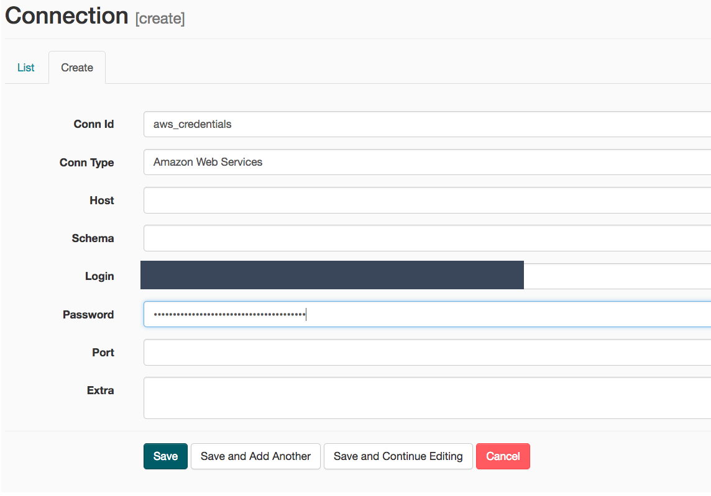
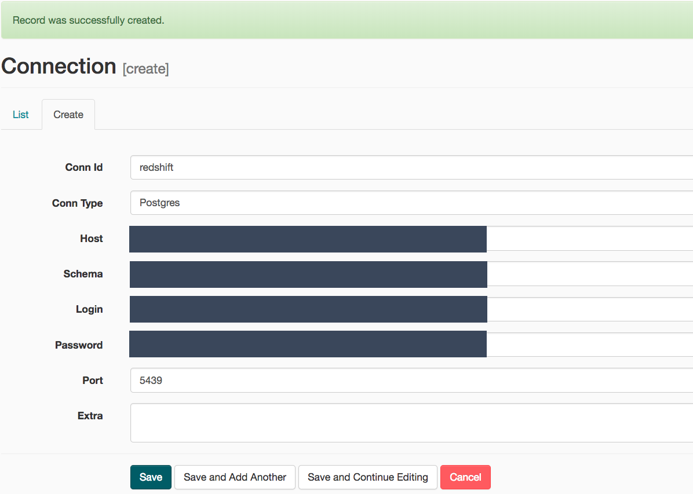

## Data Pipelines with Airflow

This README will illustrate the context/purpose of this porject and the justification on the airflow workflow.

### Purpose

Sparkify, a new startup, launched its brand new music streaming App, and it collected a lot of data related to the user activities on the App. Their data resides in S3, in a directory of JSON logs on user activity on the app, as well as a directory with JSON metadata on the songs in their app. In order to introduce more automation and monitoring to their data warehouse ETL pipelines and come to the conclusion that the best tool to achieve this is Apache Airflow.

### Airflow Workflow


### Misc

Needs to create some Airflow Connections and Variables to make it run.

- Create AWS Connection


- Launch Redshift Cluster 
```bash
> aws redshift create-cluster --node-type dc2.large --number-of-nodes 4 --master-username ***** --master-user-password ***** --cluster-identifier sparkifyredshift --region 'us-west-2'
```

- Create Redshift Connection


- Delete Redshift Cluster once the DAG finish

```bash
> aws redshift delete-cluster --cluster-identifier sparkifyredshift --skip-final-cluster-snapshot
```

_\*If want to run it locally, needs to follow this [guide](https://airflow.apache.org/docs/apache-airflow/stable/installation.html) to setup Apache Airflow_